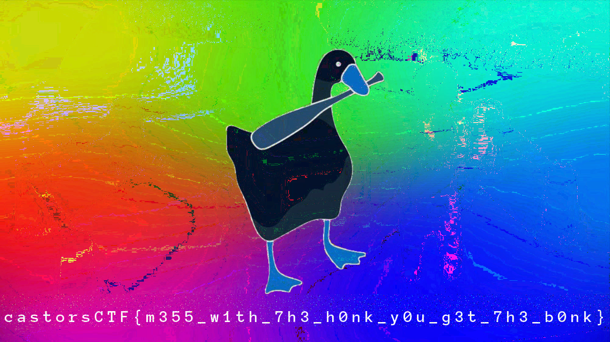

# Crypto

## Goose Chase
Challange Description: 
``` 
There's no stopping this crazy goose.
+2 PNG File
```
Challange gives us two different .png files. Both have strange looked strip at the bottom. So using `stegsolve` to combine them. And it gives the flag.




## One Tricky Pony
Challange Description: 
```
nc chals20.cybercastors.com 14422
```

It returns hex values when entered random characters. Then try to enter some spaces in it. And then it gives 
```
b'CASTORSctf[K\x13\x13P\x7fY\x10UR\x7fK\x13Y\x15\x7f\x15\x13CR\x13\x17\x7f\x14ND\x7fD\x10N\x17\x7fR\x13U\x15\x13\x7f\x17H\x13M\x01]
```

By using the [ASCII Table](https://bluesock.org/~willg/dev/ascii.html) and manually decode every hex value. And the flag is 
``` 
castorsCTF{k33p_y0ur_k3y5_53cr37_4nd_d0n7_r3u53_7h3m!}
```

## Magic School Bus
Challange Description:
```
nc chals20.cybercastors.com 14422
Flag is slightly out of format. Add underscores and submit uppercase
```
There is two options. The second one gives the flag with changing the order and making them uppercase. This was the given flag:
```
SCNTGET0SKV3CTNESYS2ISL7AF4I0SC0COM5ORS31RR3AYN1
```
And in the first option it change the given letter to uppercase and if you write multiple characters it change the order. Need to find how it change the order. To find it gave it 46 char lenght of string that has not same char in it. 
```
Input:
ABCDEFTGHIJKLMNOPRSTVYZXWQÖÇÜĞŞİ1234567890€₺½¾
Output:
TNZŞ7DKTÇ4½AHPW19CJSÖ3€BIRQ20GOİ8ELVÜ5¾FMYĞ6₺
```
Then check and note how it change the order by each index. Then apply by reversely on the given flag.The flag is:
```
CASTORSCTF{R3C0N4ISSANCE_IS_K3Y_TO_S0LV1NG_MYS73R1E5}
```

## Two Path
Challange Description:
```
The flag is somewhere in these woods, but which path should you take?
```


Using ```strings``` on the image and it gives us a binary.

```
01101000 01110100 01110100 01110000 01110011 00111010 00101111 00101111 01100111 01101111 00101110 01100001 01110111 01110011 00101111 00110010 01111010 01110101 01000011 01000110 01000011 01110000 
```
When decode it gaves this link:
```
https://go.aws/2zuCFCp
```
Where we can find a lot of random emojies like:
```
♈♓♒🌀🔁♉❌🈲♏♉❌⏺♓♒♊!_⏺💯_🔟♓🈲_♈♉♒_🔁✖♉⛎_❌⏫⏺♊,_❌⏫✖♒_🔟♓🈲_⏫♉➗✖_♊♓♏➗✖⛎_❌⏫✖_♈⏺♑⏫✖🔁!_🚺✖_➿🈲♊❌_⏫♓♑✖_🔟♓🈲_💯♓🈲♒⛎_♉_Ⓜ♓🔁✖_✖💯💯⏺♈⏺✖♒❌_🚺♉🔟_💯♓🔁_⛎✖♈⏺♑⏫✖
```
Need to decode this but to decode it we need more. So return to the image and ```stegsolve``` on it. When we change the color settings the hidden link appear in the left bottom corner. The page is named ```decode-this``` .
```
https://go.aws/2X1R6H7
```
In this link there is a chat between two people. One is texting and other only using emojies. Guessed some of the words that the second person said eg. ```hi! ``` and ```you?```. By using these letters found all alphabet in emojies. 
```
♉: A
♌: B
♈: C
⛎: D
✖ : E
💯: F
🌀: G
⏫: H
⏺: I
🆔: K
♏: L
Ⓜ: M
♒: N
♓: O
♑: P
🔁: R
♊: S
❌: T
🈲: U
🔟: Y
📶: Z
🚺: W
🔴: X
``` 
Then search castorsCTF by using emoji alpahbet in the ```decode-this``` website. The flag is:
```
castorsCTF{sancocho_flag_qjzmlpg}
```

## Jigglypuff's Song
Challange Description:
```
Can you hear Jigglypuff's song?
```


Use ```stegsolve``` on it and and then do ```data analyze``` on it with cheking only the RGB 7 boxes. The flas is in the text. 
```
castorsCTF{r1ck_ r0ll_w1lln3v3r d3s3rt_y0uuuu}
```

## Amazon
Challange Description:
```
Are you watching the new series on Amazon?
198 291 575 812 1221 1482 1955 1273 1932 2030 3813 2886 1968 4085 3243 5830 5900 5795 5628 3408 7300 4108 10043 8455 6790 4848 11742 10165 8284 5424 14986 6681 13015 10147 7897 14345 13816 8313 18370 8304 19690 22625
```
Description gaves two hints. One is ```prime``` other is ```series```. Write a script to divide every number to the prime number which has the same index.

```python
import string

numbers = ['198', '291', '575', '812',
           '1221', '1482', '1955', '1273',
           '1932', '2030', '3813', '2886',
           '1968', '4085', '3243', '5830',
           '5900', '5795', '5628', '3408',
           '7300', '4108', '10043', '8455',
           '6790', '4848', '11742', '10165',
           '8284', '5424', '14986', '6681',
           '13015', '10147', '7897', '14345',
           '13816', '8313', '18370', '8304',
           '19690', '22625']

primes = ["2","3","5","7",
           "11","13","17","19",
           "23","29","31","37",
           "41","43","47","53",
           "59","61","67","71",
           "73","79","83","89",
           "97","101","103","107",
           "109","113","127","131",
           "137","139","149","151",
           "157","163","167","173",
           "179","181"]

parts = []

for i in range(len(numbers)):
    parts.append(int(numbers[i]) // int(primes[i]))

flag = ""
for part in parts:
    print(chr(part), end="")
```
And the flag is:
```
castorsCTF{N0_End_T0d4y_F0r_L0v3_I5_X3n0n}
```
Authors: 
* https://github.com/ahmedselim2017
* https://github.com/zeyd-ilb
## 0x101 Dalmatians
Challange Description:
```
Response to Amazon: Nah, I only need to be able to watch 101 Dalmatians.

c6 22 3d 29 c1 c5 9c f5 85 e7 d7 0e 46 e6 21 e7 dd 8d db 43 a0 34 77 04 7f 32 13 8c c9 01 65 78 5f c0 14 8e 33 bf bc 02 21 79 e1 5d d3 46 e0 ca ee 72 c2 26 38
```
Challange says it response to Amazon so it should be again about prime series.

```python
primes = ["2","3","5","7","11","13","17","19","23","29","31","37","41","43","47","53","59","61","67","71","73","79","83","89","97","101","103","107","109","113","127","131","137","139","149","151","157","163","167","173","179","181","191","193","197","199","211","223","227","229","233","239","241","251","257"]

all_ct = "198 34 61 41 193 197 156 245 133 231 215 14 70 230 33 231 221 141 219 67 160 52 119 4 127 50 19 140 201 1 101 120 95 192 20 142 51 191 188 2 33 121 225 93 211 70 224 202 238 114 194 38 56".split()

alphabet = ["}","{","c","w","e","r","t","y","u","ı","o","p","a","s","d","f","g","h","j","k","l","i","z","x","q","v","b","n","m","Q","W","E","R","T","Y","U","I","O","P","A","S","D","F","G","H","J","K","L","Z","X","C","V","B","N","M","_","1","2","3","4","5","6","7","8","9","0"]

prime = primes[0]
mod = 0x101

def bf(): 
        for i in range(53):
            ct = all_ct[i]
            for b in primes:
                for u in alphabet:        
                    if ord(u) * int(b) % mod == int(ct):
                        if primes.index(b) == i:
                            print(u, end="")
                      
bf()
```
Output:
```
castorsCTF{1f_y0u_g07_th1s_w1th0u7_4ny_h1n7s_r3sp3c7}
```
Authors: 
* https://github.com/ahmedselim2017
* https://github.com/zeyd-ilb
